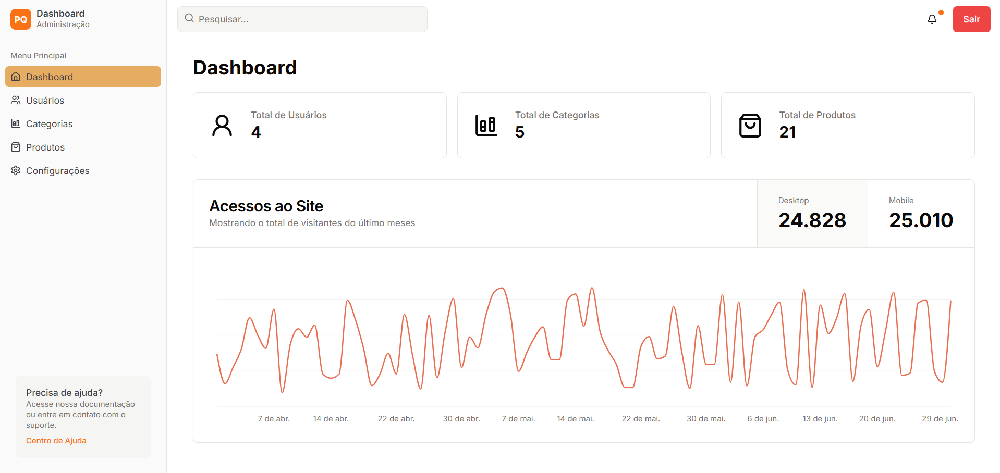

# Sistema de Gestão para Empresa Puro Queijo

## Introdução

Este sistema foi desenvolvido para a empresa **Puro Queijo de Naviraí**, com o objetivo de facilitar a gestão de categorias e produtos, incluindo a criação, edição e visualização de informações sobre os produtos. O sistema foi projetado para ser intuitivo e eficiente, permitindo que os usuários gerenciem rapidamente seu catálogo.

## Descrição do Problema

A Puro Queijo de Naviraí enfrentava dificuldades na divulgação dos seus produtos e na organização das informações sobre os produtos e categorias. A empresa necessitava de um sistema que permitisse:

- Landing page para divulgação;
- Organizar produtos em categorias;
- Manter registros detalhados dos produtos, incluindo nome, sabor, descrição e tamanho da embalagem;
- Garantir o controle de usuários, permitindo diferentes níveis de acesso conforme o papel de cada um (usuário comum ou administrador).

## Elicitação de Requisitos

Para desenvolver o sistema, os seguintes requisitos foram levantados:

### Funcionais:
- O sistema deve permitir a criação, edição e exclusão de produtos.
- O sistema deve permitir a criação, edição e exclusão de categorias de produtos.
- O sistema deve permitir a associação de produtos a categorias.
- O sistema deve controlar usuários com diferentes permissões (admin e usuário).
- O sistema deve gerar relatórios sobre produtos e categorias.

### Não Funcionais:
- A interface deve ser intuitiva e responsiva.
- O sistema deve ser acessível via web (desktop e mobile).
- O sistema deve ter alta disponibilidade e ser fácil de usar.

## Diagrama de Classes

Aqui está o diagrama de classes do sistema:

## Tecnologias Utilizadas

- **Next.js**: Framework React para construção da interface.
- **ShadCN UI**: Biblioteca de componentes UI para uma interface moderna e responsiva.
- **Prisma**: ORM para gerenciar a conexão e manipulação do banco de dados.
- **SQLite**: Banco de dados utilizado para persistência dos dados.
- **Zod**: Biblioteca para validação de dados de entrada, garantindo maior segurança e integridade.
- **React Hook Form**: Biblioteca para gerenciar formulários e validações de forma eficiente.

## Imagens das Telas

### Tela de Dashboard

### Tela de Gerenciamento de Usuários

### Tela de Gerenciamento de Categorias

### Tela de Gerenciamento de Produtos

---

### Link do Deploy

O sistema pode ser acessado no seguinte link:  [Deploy do Sistema](https://sistema-puro-queijo.vercel.app/)
